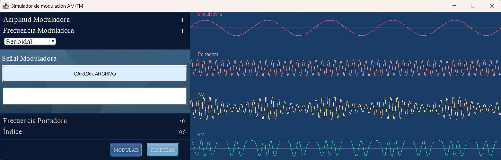

# Proyecto POO - Modulador

Aplicación de escritorio desarrollada en Java que genera diferentes tipos de señales (senoidal, cuadrada, triangular) y aplica modulación en **Amplitud (AM)** y **Frecuencia (FM)**. Permite visualizar simultáneamente la señal moduladora, portadora y las dos señales moduladas.

## Interfaz Gráfica de Usuario

## Manual de usuario
1. Seleccionar tipo de señal moduladora en el desplegable.

2. Ajustar amplitud (por defecto 1) y frecuencia (por defecto 1 Hz) de la moduladora.

3. Ajustar frecuencia portadora (por defecto 10 Hz) e índice de modulación (por defecto 0.5).

4. (Opcional) Cargar un archivo de texto con un número real por línea. La señal cargada reemplazará a la generada internamente.

5. Pulsar MODULAR.

6. Observar las cuatro señales dibujadas en el panel derecho.

7. Pulsar RESETEAR para limpiar.

Formato del archivo de texto
- Extensión .txt.
- Un valor numérico por línea (ej. 0.5, -1.2, 3.14).
- Se pueden usar puntos decimales, no comas.

## Características

- Generación de tres tipos de señales moduladoras:
  - Senoidal
  - Cuadrada
  - Triangular
- Modulación en Amplitud (AM) con índice ajustable.
- Modulación en Frecuencia (FM) con sensibilidad ajustable.
- Carga de señal moduladora personalizada desde archivo `.txt`.
- Visualización gráfica en tiempo real con colores distintivos.
- Interfaz gráfica intuitiva (Swing).
- Botón de reset para restablecer todos los parámetros.

## Páginas de interés
- Para entender **¿Cuál es la diferencia entre AM y FM?** visitar: https://es.fmuser.net/content/?953.html
